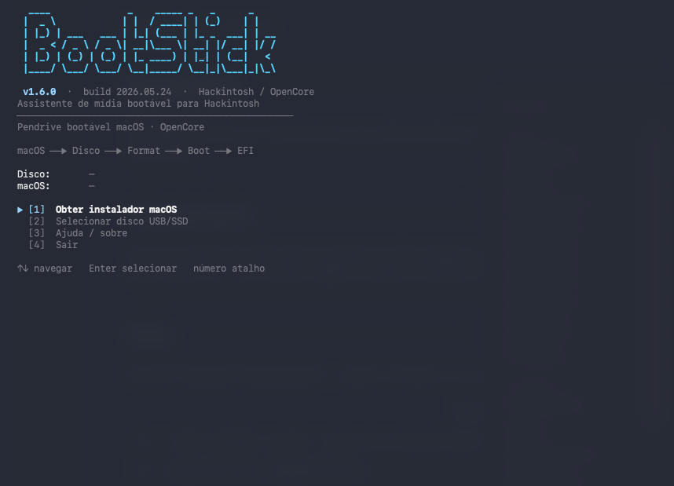

# BootStick

Assistente interativo em Terminal para criar mídia bootável de instalação do macOS em projetos Hackintosh (OpenCore).

<div align="center">
  
</div>

---

## Para que serve

Criar um pendrive ou SSD externo bootável com o instalador do macOS e preparar a partição EFI para receber a pasta OpenCore — sem precisar digitar comandos manualmente.

---

## Fluxo

Dois pré-requisitos independentes — podem ser feitos em qualquer ordem:

| | Ação |
|-|------|
| **macOS** | Obter instalador — baixar dos servidores Apple ou selecionar um `.app` já existente em `/Applications` |
| **Disco** | Selecionar o pendrive ou SSD externo |

Com os dois prontos, o menu guia pelo restante:

| | Ação |
|-|------|
| **Formatar** | Formata o disco em GPT + Mac OS Extended (JHFS+) |
| **Boot** | Cria a mídia bootável com `createinstallmedia` |
| **EFI** | Monta e abre a partição EFI no Finder |

Navegue com as setas ↑↓ ou pressione o número da opção.

---

## Requisitos

- macOS (host Apple)
- Instalador do macOS em `/Applications`
- Pendrive ou SSD externo — mínimo 16 GB (recomendado 32 GB+)
- Senha de administrador (`sudo`)
- OpenCore — o BootStick não gera EFI; copie sua pasta `EFI` manualmente após a etapa **EFI**

---

## Uso

Baixe o `.zip` em [Releases](https://github.com/lhdeveloper/BootStick/releases), extraia e execute:

```bash
chmod +x BootStick.command
./BootStick.command
```

Ou dê duplo clique no `BootStick.command` no Finder.

---

## Avisos

- A etapa **Formatar** apaga todos os dados do disco selecionado.
- Confirme sempre o disco antes de formatar.
- Use por sua conta e risco.
